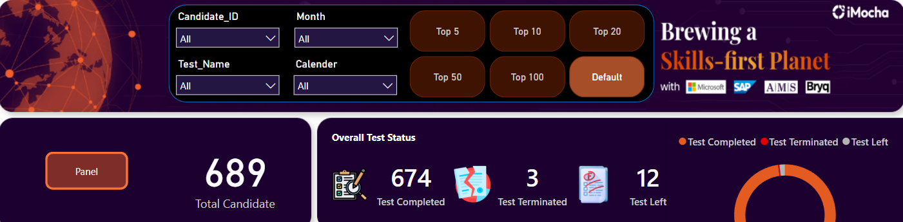
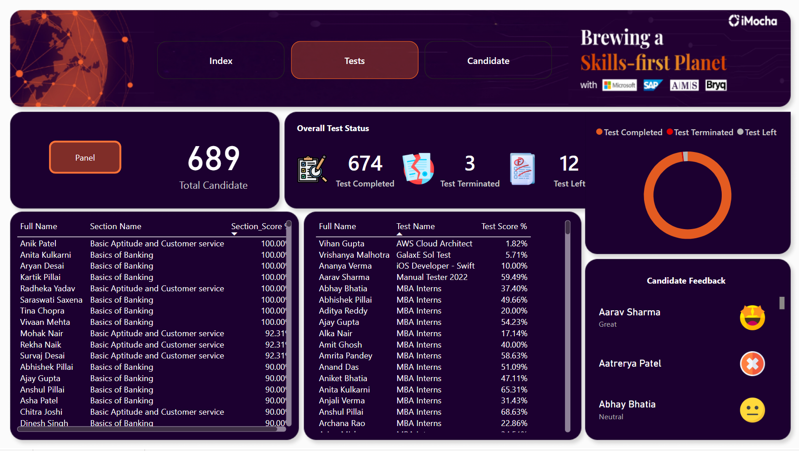
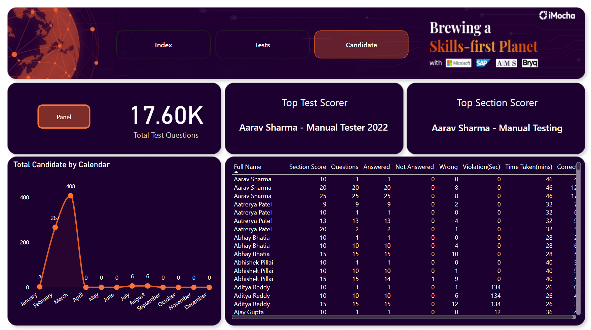

# iMocha Examination Report

[Project Link](https://app.powerbi.com/view?r=eyJrIjoiOGY3MDFhOTItZjMzNi00YWQ4LWFlZjQtMDM1OWU1NGE0NTI0IiwidCI6IjIxZTcwODQ2LTI1ZjktNGYzMy05ZjVhLTVmMzljMWQ2NzIwMCIsImMiOjF9) 

## **Data Import and Transformation**
The project started by importing data from an Excel file into Power BI. After importing, I carefully examined the data to ensure it was clean and consistent. No significant data type changes or blanks were found, so I proceeded directly to visualization development.

---

## **Dashboard Pages and Details**

### **1. Tests Page**
- **Candidate Measures:** Custom measures were created using DAX, ensuring data integrity by leveraging the `ISBLANK()` function to avoid blank results.
  - **Total Candidates:** Displays the total number of candidates who attempted tests.
  - **Test Completed:** Measure for the count of completed tests.
  - **Test Terminated:** Measure to track terminated tests.
  - **Test Left:** Tracks tests that were initiated but not completed.
  
- **Visualizations:**
  - **Donut Chart:** Used to represent overall test status for better visual clarity and proportional representation.
  - **Candidate Feedback:** Represented using emoticons to categorize feedback as Great, Neutral, No Feedback, and Not Good, providing an intuitive and engaging visualization.

---

### **2. Candidate Page**
- **Line Chart:** Displays the total candidates over time by calendar to show trends and patterns in test participation. Line charts are ideal for showing data progression over time.
- **Top Test Scorer and Top Section Scorer Cards:** Highlight the best-performing candidates along with their respective test names to provide focused insights.
- **Table:** Displays candidate details, including:
  - Full Name, Questions, Answered, Not Answered, Wrong, Violations (sec), Time Taken (mins), Correct answers.
  
- **Dynamic Slicer Panel:** Created using buttons for better user interaction, enabling users to filter data by:
  - Candidate ID, Test Name, Month, Calendar, and top rankings (Top 5, Top 10, Top 20, Top 50, Top 100).
  - The top-ranking filters show all candidates with the same score, even if their count exceeds the filter limit. For instance, a top 5 filter may display up to 20 candidates if multiple share the same score.

---

### **3. Index Page**
- **Navigation:** Buttons were included to allow seamless navigation between the Tests and Candidate pages, improving user experience.

---

## **Why Graphs and Charts Were Used**
- **Donut Chart:** Simplifies the representation of test completion statuses and provides an easily understandable proportional view.
- **Line Chart:** Helps track trends over time and highlights patterns in candidate test participation.
- **Cards:** Summarize key insights like top scorers for quick reference.
- **Table:** Provides detailed and structured information for in-depth analysis.
- **Dynamic Slicers:** Enhance user interaction by allowing flexible data exploration.

## **Images of the Dashboard**

1. **Home Page**  
   

2. **Slicer**  
   

3. **Test Page**  
   

4. **Candidate**  
   

